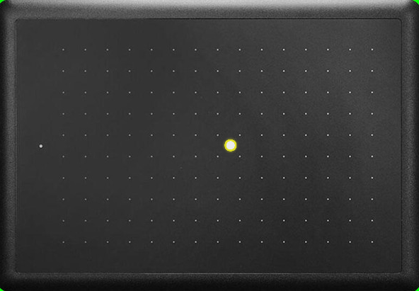
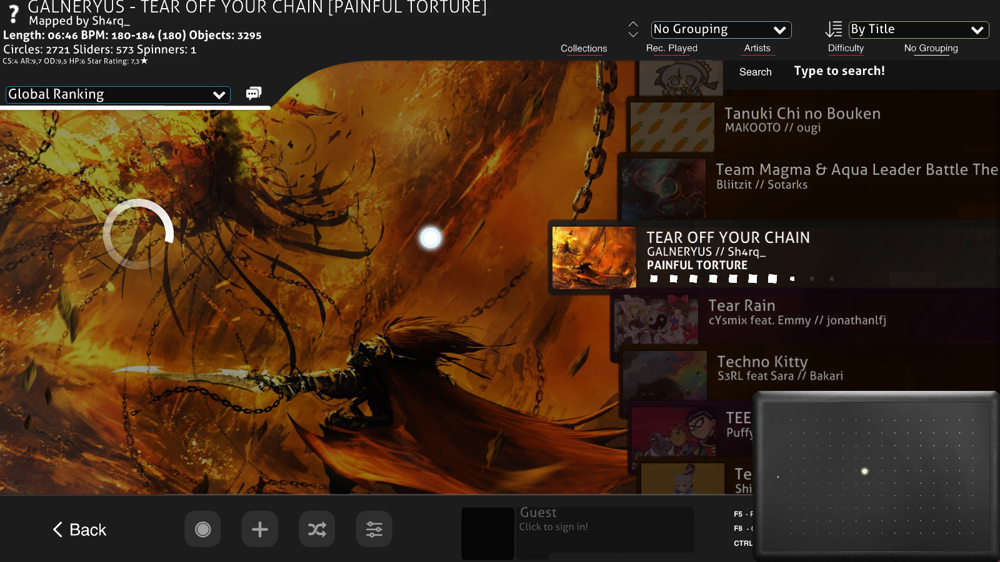

# Tablet Visualizer for osu!

Tablet Visualizer is a lightweight application designed to function as an overlay for OBS . It simulates a graphic tablet's surface and shows real-time input based on your mouse or tablet stylus movements. You can easily customize the entire program visuals by modifying `Settings.json` file.


[](https://choosealicense.com/licenses/gpl-3.0/)
[](https://app.codacy.com/gh/xO-3670/Tablet-Visualizer/dashboard?utm_source=gh&utm_medium=referral&utm_content=&utm_campaign=Badge_grade)
[](https://github.com/xO-3670/Tablet-Visualizer/releases/tag/1.1)
[](https://github.com/xO-3670/Tablet-Visualizer/actions/workflows/cmake-multi-platform.yml)


## Features

- Background of window is green

- Converts mouse/stylus movements into a visual representation on a customizable tablet image.

- You can change the default tablet and cursor image in the `Settings.json` file

- Modify cursor size, skin, and behavior (trail density, lifetime) in `Settings.json`
## Screenshots





# How to edit Settings.json

| Parameter | Type          | Description or examples                                                    |
| :------------------------ | :-------------- | :------------------------------------------------------- |
| `WindowDimensions`        | `uint32_t`      | Size of application's window                             |
| `CursorTrailDensity`      | `uint32_t`      | Number of circles in trail                               |
| `FramerateLimit`          | `uint32_t`      | Applying high limit will increase cpu usage default: 120 |
| `TabletImageTransparency` | `uint8_t`       | Transparency of tablet's image  0-255                    |
| `TabletArea`              | `sf::FloatRect` | first two are offset. 0, 0, 152, 95 is default full area |
| `CursorSize`              | `float_t`       | Size of cursor                                           |
| `CursorTrailSize`         | `float_t`       | Size of trail's circles                                  |
| `TrailCirclesLifetime`    | `float_t`       | How long trail's circles stay on screen                  |
| `CursorImage`             | `string`        | Path to cursor's image                                   |
| `CursorTrailImage`        | `string`        | Path to cursor trail's image                             |
| `CustomTabletImage`       | `string`        | Path to custom tablet image                              |
| `CustomTablet`            | `bool`          | Condition if you're using custom tablet image            |
| `EnableErrors`            | `bool`          | Condition if console with errors will show default: true |
| `TrailCirclesFadingEffect`| `bool`          | Enable fading of trail circles like in osu default: true |
| `CustomTabletSize`        |`sf::Vector2f`   | Real size of tablet in mm                                |
| `CustomTabletImageOffset` |`sf::Vector2f`   | Offset in custom tablet image to active area             |
| `CustomTabletActiveArea`  |`sf::Vector2f`   | Active area of custom tablet                             |

### If you want to customize it you should set:

- `CustomTablet` to `true`

- `WindowDimensions` to your custom tablet's image size

- `CustomTabletImage` to the path of your custom tablet's image (you can also place it in the same folder and instead of full path just use name and extension of your custom image)

- `CustomTabletSize` to full size of your custom tablet in mm (you can find this in your tablet's website)

- `CustomTabletActiveArea` to size of tablet's active area in mm (you can also find this in your tablet's website)

- `CustomTabletImageOffset` to position in your image where active area start (you can open image in paint and put cursor in left upper corner of tablet's active area and in left bottom corner of paint window you should be able to see coordinates)

- `TabletArea` to your custom tablet area. First two value are x, y offset and the last ones are width and height of tablet area


# How to build

- First step: Download source
```bash
  git clone https://github.com/xO-3670/Tablet-Visualizer.git
```

- Second step: Create build folder and build
```bash
  mkdir build && cd build
  cmake ..
```

## Linux build dependencies
```bash
libx11-dev 
libxrandr-dev
libxcursor-dev
libxi-dev
libudev-dev
libfreetype-dev
libflac-dev
libvorbis-dev
libgl1-mesa-dev
libegl1-mesa-dev 
libfreetype-dev
libopenal-dev
```

